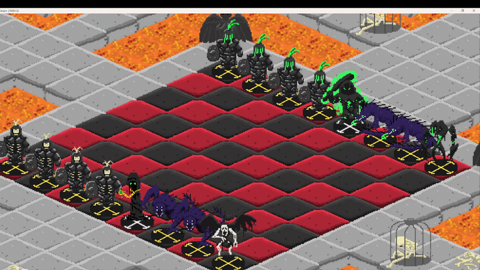

# Proyecto Isométrico 2D

Este es un proyecto 2D isométrico desarrollado en **Godot Engine 3.x**.

---

## Características

- **Grid isométrico** — Cámara y tilemap 2D isométrico
- **Movimiento por grid** — Movimiento del jugador tile a tile en el plano isométrico
- **Sistema de guardado** — Estado persistente del juego vía `save.gd`
- **Sistema de habilidades** — Clase base `Hability` extensible en GDScript
- **Control de zoom** — Zoom con la rueda del ratón
- **Fuentes y sprites personalizados** — Recursos visuales seleccionados

---

## Estructura del Proyecto
├── Escena/          # Escenas del juego (HUD, niveles)
├── Script/          # Lógica en GDScript — movimiento, habilidades, guardado
├── Sprite/          # Spritesheets y recursos gráficos
├── fuentes/         # Fuentes personalizadas
├── DEMOS/           # Escenas de prototipado y referencia
├── PDF/             # Documentación de diseño
├── Explicacion/     # Notas y explicaciones adicionales
└── project.godot   # Punto de entrada del proyecto Godot

---

## Controles

| Input | Acción |
|---|---|
| Click Izquierdo | Seleccionar |
| Rueda del ratón | Zoom in / out |
| Escape | Pausar |

---

Desarrollado por [Nico Rueda](https://github.com/NicoRuedaA)